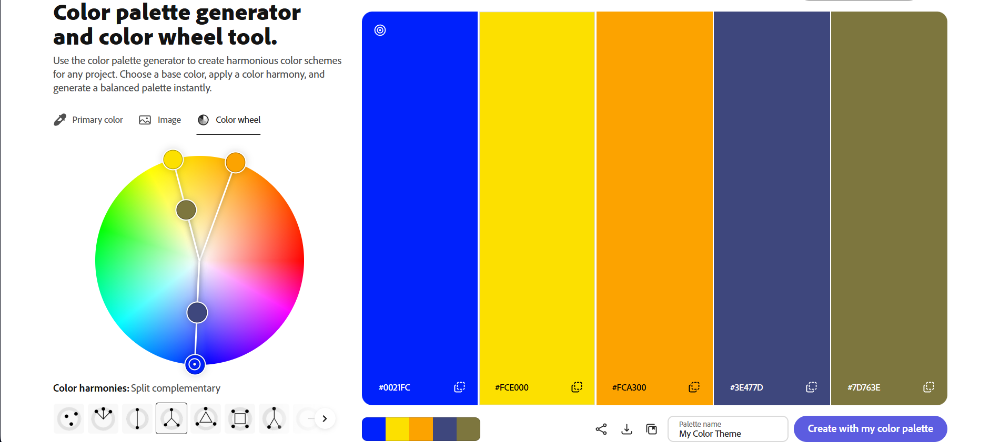

Max Gambino
===

https://a1-maxgambino.onrender.com

This project is my personal introduction page for CS 4241, showcasing my background, coursework, and experience with HTML, CSS, and JavaScript.

## Technical Achievements
- Styled page with CSS: Applied rules across `body`, `header`, `h1`, `h2`, `section`, `ul li`, `a`, `a:hover`, and `footer`, including layout (`max-width`, `margin`, `padding`), typography (`font-family`, `letter-spacing`, `line-height`), colors, and borders.
- JavaScript animation: Added `script.js`, which fades the main content in by changing opacity from 0 to 1 over 1 second when the page loads, using `requestAnimationFrame` and a CSS `transition`.
- Semantic HTML tags: Structured the page with `<header>`, `<main>`, `<section>`, `<footer>`, and `<a>` instead of generic `
` tags, making the document structure meaningful.

## Design Achievements
- Color palette: Built a custom 5-color palette on color.adobe.com (`#0021FC`, `#FCE000`, `#FCA300`, `#3E477D`, `#7D763E`) and used all five across the page (background, headings, links, borders). I checked contrast ratios with WebAIM's contrast checker so that text colors (yellow/orange on the dark navy background) stay readable, while the two lower-contrast colors (blue, olive) are used only for decorative borders.
  - Palette screenshot: 
- Google Font: Used "IBM Plex Sans Devanagari" from Google Fonts as the site's primary typeface.
